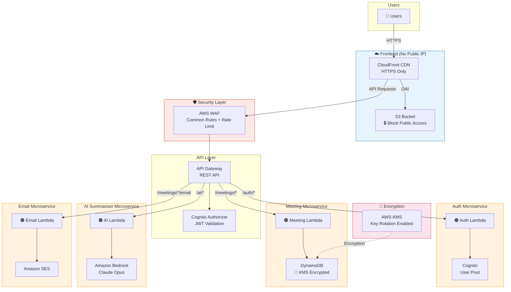

# Meeting Minutes AI

ระบบบันทึกรายงานการประชุมพร้อม AI สรุปการประชุม และส่งสรุปทางอีเมลอัตโนมัติ บน AWS Serverless Architecture

## Architecture



## Features

- 📝 บันทึกรายงานการประชุม (ผู้ร่วมประชุม, หัวข้อ, ข้อหารือ, Next Steps)
- 🤖 AI สรุปการประชุมด้วย Claude Opus (เลือก model ได้)
- 📧 ส่งสรุปทางอีเมลไปยังผู้เข้าร่วมประชุมอัตโนมัติ
- 🔐 ลงทะเบียน / เข้าสู่ระบบด้วย Cognito
- 📋 จัดการรายงานการประชุม (CRUD)

## Tech Stack

| Layer | Technology |
|-------|-----------|
| Frontend | React + Vite + TypeScript |
| Auth | Amazon Cognito (JWT) |
| API | API Gateway + AWS WAF |
| Compute | AWS Lambda (Node.js 20.x) |
| Database | DynamoDB (KMS encrypted) |
| AI | Amazon Bedrock (Claude Opus) |
| Email | Amazon SES |
| CDN | CloudFront + S3 (private) |
| IaC | CloudFormation (nested stacks) |

## Project Structure

```
├── infra/                    # CloudFormation templates
│   ├── main-stack.yaml       # Main stack (API GW, WAF, CloudFront, S3)
│   ├── auth-stack.yaml       # Auth microservice (Cognito + Lambda)
│   ├── meeting-stack.yaml    # Meeting microservice (DynamoDB + Lambda)
│   ├── ai-stack.yaml         # AI microservice (Lambda + Bedrock)
│   ├── email-stack.yaml      # Email microservice (Lambda + SES)
│   └── architecture-diagram.drawio
├── services/
│   ├── auth/                 # Auth Lambda handlers
│   ├── meeting/              # Meeting Lambda handlers
│   ├── ai/                   # AI Summarizer Lambda handlers
│   └── email/                # Email Lambda handlers
├── shared/                   # Shared types, validators, constants
├── client/                   # React frontend (SPA)
└── tests/
    ├── unit/                 # Unit tests
    ├── property/             # Property-based tests (fast-check)
    └── integration/          # Integration tests
```

## Security

- ✅ No public IP exposed (CloudFront + API Gateway only)
- ✅ S3 Block Public Access enabled
- ✅ DynamoDB encrypted with AWS KMS (key rotation)
- ✅ AWS WAF with managed rules + rate limiting
- ✅ IAM least privilege on all Lambda roles
- ✅ HTTPS enforced everywhere
- ✅ X-Ray tracing enabled

---

## การติดตั้งและใช้งาน (Installation)

### สิ่งที่ต้องมี

- [Node.js](https://nodejs.org/) v18+
- [Git](https://git-scm.com/)

### 1. Clone โปรเจกต์

```bash
git clone https://github.com/hellokrisada/Meeting-note.git
cd Meeting-note
```

### 2. ติดตั้ง Dependencies

```bash
npm run install-all
```

### 3. ตั้งค่า Environment Variables

```bash
cp .env.example .env
cp client/.env.example client/.env
```

แก้ไขไฟล์ `.env`:
```
JWT_SECRET=ใส่-secret-key-ของคุณ
PORT=3001
```

### 4. รัน Local Development

```bash
npm run dev
```

- Frontend: http://localhost:3000
- Backend API: http://localhost:3001

### 5. รัน Tests

```bash
npx jest                    # รันทั้งหมด
npx jest tests/unit         # เฉพาะ unit tests
npx jest tests/property     # เฉพาะ property-based tests
npx jest tests/integration  # เฉพาะ integration tests
```

> 📖 ดูรายละเอียดเพิ่มเติมที่ [INSTALLATION.md](INSTALLATION.md)

---

## Deploy บน AWS

### สิ่งที่ต้องมีเพิ่มเติม

- บัญชี [AWS](https://aws.amazon.com/)
- [AWS CLI](https://aws.amazon.com/cli/) ติดตั้งและตั้งค่าแล้ว

### Quick Deploy (สำหรับผู้มีประสบการณ์)

```bash
# ตั้งค่าตัวแปร
ACCOUNT_ID=$(aws sts get-caller-identity --query Account --output text)
LAMBDA_BUCKET=meeting-minutes-lambda-${ACCOUNT_ID}
TEMPLATES_BUCKET=meeting-minutes-templates-${ACCOUNT_ID}
REGION=ap-southeast-1

# สร้าง S3 buckets
aws s3 mb s3://$LAMBDA_BUCKET --region $REGION
aws s3 mb s3://$TEMPLATES_BUCKET --region $REGION

# Upload CloudFormation templates
aws s3 cp infra/auth-stack.yaml s3://$TEMPLATES_BUCKET/
aws s3 cp infra/meeting-stack.yaml s3://$TEMPLATES_BUCKET/
aws s3 cp infra/ai-stack.yaml s3://$TEMPLATES_BUCKET/
aws s3 cp infra/email-stack.yaml s3://$TEMPLATES_BUCKET/

# Build & upload Lambda code (ทำซ้ำสำหรับแต่ละ service)
for svc in auth meeting ai email; do
  cd services/$svc && npm install && npx tsc && \
  zip -r handler.zip src/ node_modules/ package.json && \
  aws s3 cp handler.zip s3://$LAMBDA_BUCKET/$svc/handler.zip && \
  cd ../..
done

# Deploy stack
aws cloudformation create-stack \
  --stack-name meeting-minutes-ai \
  --template-body file://infra/main-stack.yaml \
  --capabilities CAPABILITY_NAMED_IAM CAPABILITY_AUTO_EXPAND \
  --parameters \
    ParameterKey=Environment,ParameterValue=dev \
    ParameterKey=LambdaCodeBucket,ParameterValue=$LAMBDA_BUCKET \
    ParameterKey=TemplatesBucket,ParameterValue=$TEMPLATES_BUCKET \
    ParameterKey=SenderEmail,ParameterValue=noreply@yourdomain.com
```

### Deploy Frontend ไปยัง S3 + CloudFront

```bash
# ดู API URL จาก CloudFormation output
API_URL=$(aws cloudformation describe-stacks \
  --stack-name meeting-minutes-ai \
  --query 'Stacks[0].Outputs[?OutputKey==`ApiGatewayUrl`].OutputValue' \
  --output text)

# ตั้งค่า API URL แล้ว build
echo "VITE_API_URL=$API_URL" > client/.env
cd client && npm run build && cd ..

# Upload ไปยัง S3
FRONTEND_BUCKET=$(aws cloudformation describe-stacks \
  --stack-name meeting-minutes-ai \
  --query 'Stacks[0].Outputs[?OutputKey==`FrontendBucketName`].OutputValue' \
  --output text)
aws s3 sync client/dist/ s3://$FRONTEND_BUCKET/

# ล้าง CloudFront cache
DIST_ID=$(aws cloudformation describe-stacks \
  --stack-name meeting-minutes-ai \
  --query 'Stacks[0].Outputs[?OutputKey==`CloudFrontDistributionId`].OutputValue' \
  --output text)
aws cloudfront create-invalidation --distribution-id $DIST_ID --paths "/*"
```

### ดู URLs ของระบบ

```bash
# API URL
aws cloudformation describe-stacks --stack-name meeting-minutes-ai \
  --query 'Stacks[0].Outputs[?OutputKey==`ApiGatewayUrl`].OutputValue' --output text

# Frontend URL
aws cloudformation describe-stacks --stack-name meeting-minutes-ai \
  --query 'Stacks[0].Outputs[?OutputKey==`CloudFrontUrl`].OutputValue' --output text
```

### ลบระบบทั้งหมด

```bash
# ลบไฟล์ใน S3 ก่อน
aws s3 rm s3://$FRONTEND_BUCKET --recursive

# ลบ stack
aws cloudformation delete-stack --stack-name meeting-minutes-ai
```

> 📖 **ผู้เริ่มต้นใช้ AWS:** ดูคู่มือแบบละเอียดทีละขั้นตอนที่ [AWS-DEPLOYMENT-GUIDE.md](AWS-DEPLOYMENT-GUIDE.md)
>
> 📖 **รายละเอียด Infrastructure:** ดูที่ [infra/README.md](infra/README.md)

---

## ค่าใช้จ่ายโดยประมาณ

สำหรับการใช้งานเบื้องต้น (AWS Free Tier):

| Service | Free Tier |
|---------|-----------|
| Lambda | 1M requests/เดือน ฟรี |
| DynamoDB | 25GB ฟรี |
| API Gateway | 1M calls/เดือน ฟรี (12 เดือน) |
| Cognito | 50,000 MAU ฟรี |
| SES | 62,000 emails/เดือน ฟรี |
| Bedrock (Claude) | ไม่มี Free Tier (~$15/1M tokens) |

> โปรเจกต์ทดสอบ: ประมาณ **$0-5/เดือน** (ส่วนใหญ่จาก Bedrock)

## License

ISC
