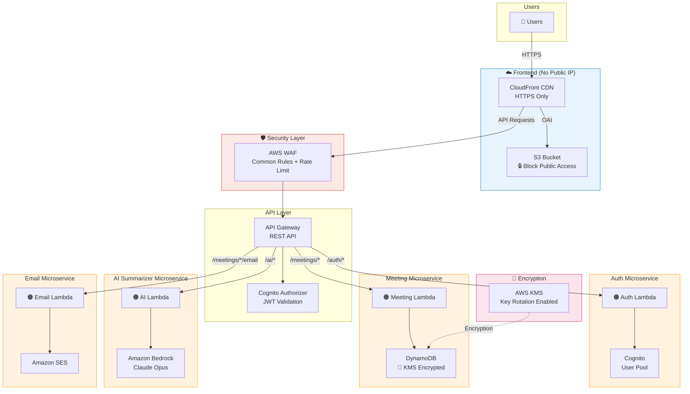

# Meeting Minutes AI

ระบบบันทึกรายงานการประชุมพร้อม AI สรุปการประชุม และส่งสรุปทางอีเมลอัตโนมัติ บน AWS Serverless Architecture

## Architecture



## Features

- 📝 บันทึกรายงานการประชุม (ผู้ร่วมประชุม, หัวข้อ, ข้อหารือ, Next Steps)
- 🤖 AI สรุปการประชุมด้วย Claude Opus (เลือก model ได้)
- 📧 ส่งสรุปทางอีเมลไปยังผู้เข้าร่วมประชุมอัตโนมัติ
- 🔐 ลงทะเบียน / เข้าสู่ระบบด้วย Cognito
- 📋 จัดการรายงานการประชุม (CRUD)

## Tech Stack

| Layer | Technology |
|-------|-----------|
| Frontend | React + Vite + TypeScript |
| Auth | Amazon Cognito (JWT) |
| API | API Gateway + AWS WAF |
| Compute | AWS Lambda (Node.js 20.x) |
| Database | DynamoDB (KMS encrypted) |
| AI | Amazon Bedrock (Claude Opus) |
| Email | Amazon SES |
| CDN | CloudFront + S3 (private) |
| IaC | CloudFormation (nested stacks) |

## Project Structure

```
├── infra/                    # CloudFormation templates
│   ├── main-stack.yaml       # Main stack (API GW, WAF, CloudFront, S3)
│   ├── auth-stack.yaml       # Auth microservice (Cognito + Lambda)
│   ├── meeting-stack.yaml    # Meeting microservice (DynamoDB + Lambda)
│   ├── ai-stack.yaml         # AI microservice (Lambda + Bedrock)
│   ├── email-stack.yaml      # Email microservice (Lambda + SES)
│   └── architecture-diagram.drawio
├── services/
│   ├── auth/                 # Auth Lambda handlers
│   ├── meeting/              # Meeting Lambda handlers
│   ├── ai/                   # AI Summarizer Lambda handlers
│   └── email/                # Email Lambda handlers
├── shared/                   # Shared types, validators, constants
└── client/                   # React frontend (SPA)
```

## Security

- ✅ No public IP exposed (CloudFront + API Gateway only)
- ✅ S3 Block Public Access enabled
- ✅ DynamoDB encrypted with AWS KMS (key rotation)
- ✅ AWS WAF with managed rules + rate limiting
- ✅ IAM least privilege on all Lambda roles
- ✅ HTTPS enforced everywhere
- ✅ X-Ray tracing enabled

## Quick Start

```bash
# 1. Upload nested templates
aws s3 cp infra/auth-stack.yaml s3://$TEMPLATES_BUCKET/
aws s3 cp infra/meeting-stack.yaml s3://$TEMPLATES_BUCKET/
aws s3 cp infra/ai-stack.yaml s3://$TEMPLATES_BUCKET/
aws s3 cp infra/email-stack.yaml s3://$TEMPLATES_BUCKET/

# 2. Deploy
aws cloudformation create-stack \
  --stack-name meeting-minutes-ai \
  --template-body file://infra/main-stack.yaml \
  --capabilities CAPABILITY_NAMED_IAM CAPABILITY_AUTO_EXPAND \
  --parameters \
    ParameterKey=Environment,ParameterValue=dev \
    ParameterKey=LambdaCodeBucket,ParameterValue=$LAMBDA_BUCKET \
    ParameterKey=TemplatesBucket,ParameterValue=$TEMPLATES_BUCKET \
    ParameterKey=SenderEmail,ParameterValue=noreply@yourdomain.com
```

ดูรายละเอียดเพิ่มเติมที่ [infra/README.md](infra/README.md)
