# Meeting Minutes AI - AWS CloudFormation Infrastructure

ระบบบันทึกรายงานการประชุมพร้อม AI สรุปการประชุม บน AWS Serverless Architecture

## Architecture Overview

> 📐 ไฟล์ Draw.io อยู่ที่ [`architecture-diagram.drawio`](architecture-diagram.drawio) — เปิดด้วย [draw.io](https://app.diagrams.net/)

```mermaid
graph TB
    subgraph Users
        U["👤 Users"]
    end

    subgraph Frontend["☁️ Frontend (No Public IP)"]
        CF["CloudFront CDN<br/>HTTPS Only"]
        S3["S3 Bucket<br/>🔒 Block Public Access"]
        CF -- "OAI" --> S3
    end

    subgraph Security["🛡️ Security Layer"]
        WAF["AWS WAF<br/>Common Rules + Rate Limit"]
    end

    subgraph API["API Layer"]
        APIGW["API Gateway<br/>REST API"]
        COGAUTH["Cognito Authorizer<br/>JWT Validation"]
        APIGW --> COGAUTH
    end

    subgraph AuthMS["Auth Microservice"]
        AUTH_FN["🟠 Auth Lambda"]
        COGNITO["Cognito<br/>User Pool"]
        AUTH_FN --> COGNITO
    end

    subgraph MeetingMS["Meeting Microservice"]
        MEET_FN["🟠 Meeting Lambda"]
        DDB["DynamoDB<br/>🔐 KMS Encrypted"]
        MEET_FN --> DDB
    end

    subgraph AIMS["AI Summarizer Microservice"]
        AI_FN["🟠 AI Lambda"]
        BEDROCK["Amazon Bedrock<br/>Claude Opus"]
        AI_FN --> BEDROCK
    end

    subgraph EmailMS["Email Microservice"]
        EMAIL_FN["🟠 Email Lambda"]
        SES["Amazon SES"]
        EMAIL_FN --> SES
    end

    subgraph Encryption["🔑 Encryption"]
        KMS["AWS KMS<br/>Key Rotation Enabled"]
    end

    U -- "HTTPS" --> CF
    CF -- "API Requests" --> WAF
    WAF --> APIGW
    APIGW -- "/auth/*" --> AUTH_FN
    APIGW -- "/meetings/*" --> MEET_FN
    APIGW -- "/ai/*" --> AI_FN
    APIGW -- "/meetings/*/email" --> EMAIL_FN
    KMS -. "Encryption" .-> DDB

    style Frontend fill:#e8f4fd,stroke:#147EBA
    style Security fill:#fde8e8,stroke:#DD3522
    style AuthMS fill:#fff3e0,stroke:#FF9900
    style MeetingMS fill:#fff3e0,stroke:#FF9900
    style AIMS fill:#fff3e0,stroke:#FF9900
    style EmailMS fill:#fff3e0,stroke:#FF9900
    style Encryption fill:#fce4ec,stroke:#DD344C
```



## Stack Structure

```
infra/
├── main-stack.yaml          # Main stack (API Gateway, WAF, CloudFront, S3, Nested Stacks)
├── auth-stack.yaml          # Auth Microservice (Cognito + Lambda)
├── meeting-stack.yaml       # Meeting Microservice (DynamoDB + KMS + Lambda)
├── ai-stack.yaml            # AI Summarizer Microservice (Lambda + Bedrock)
├── email-stack.yaml         # Email Microservice (Lambda + SES)
├── architecture-diagram.drawio  # Draw.io architecture diagram
└── README.md
```

## AWS Services Used

| Service | Purpose |
|---------|---------|
| CloudFront | CDN + HTTPS (no IP exposed) |
| S3 | Frontend hosting (Block Public Access) |
| API Gateway | REST API entry point |
| AWS WAF | Web Application Firewall |
| Cognito | User authentication + JWT |
| Lambda | Serverless compute (4 microservices) |
| DynamoDB | Meeting data storage (KMS encrypted) |
| Amazon Bedrock | AI summarization (Claude Opus default) |
| Amazon SES | Email delivery |
| AWS KMS | Data encryption at rest |

## Security Features

- ✅ No public IP addresses exposed
- ✅ S3 Block Public Access enabled
- ✅ DynamoDB encrypted with AWS KMS (key rotation enabled)
- ✅ AWS WAF with managed rule sets + rate limiting
- ✅ IAM roles follow least privilege principle
- ✅ HTTPS enforced via CloudFront
- ✅ Cognito JWT authorization on all protected endpoints
- ✅ X-Ray tracing enabled on all Lambda functions

## Prerequisites

1. AWS CLI configured with appropriate credentials
2. S3 bucket for Lambda deployment packages
3. S3 bucket for CloudFormation nested templates
4. Verified email address in Amazon SES
5. (Optional) Custom domain + ACM certificate

## Deployment

### 1. Upload nested templates to S3

```bash
TEMPLATES_BUCKET=your-templates-bucket

aws s3 cp auth-stack.yaml s3://$TEMPLATES_BUCKET/
aws s3 cp meeting-stack.yaml s3://$TEMPLATES_BUCKET/
aws s3 cp ai-stack.yaml s3://$TEMPLATES_BUCKET/
aws s3 cp email-stack.yaml s3://$TEMPLATES_BUCKET/
```

### 2. Package and upload Lambda code

```bash
LAMBDA_BUCKET=your-lambda-bucket

# Package each service and upload
cd ../services/auth && zip -r handler.zip . && aws s3 cp handler.zip s3://$LAMBDA_BUCKET/auth/
cd ../meeting && zip -r handler.zip . && aws s3 cp handler.zip s3://$LAMBDA_BUCKET/meeting/
cd ../ai && zip -r handler.zip . && aws s3 cp handler.zip s3://$LAMBDA_BUCKET/ai/
cd ../email && zip -r handler.zip . && aws s3 cp handler.zip s3://$LAMBDA_BUCKET/email/
```

### 3. Deploy main stack

```bash
aws cloudformation create-stack \
  --stack-name meeting-minutes-ai-dev \
  --template-body file://main-stack.yaml \
  --capabilities CAPABILITY_NAMED_IAM CAPABILITY_AUTO_EXPAND \
  --parameters \
    ParameterKey=Environment,ParameterValue=dev \
    ParameterKey=LambdaCodeBucket,ParameterValue=$LAMBDA_BUCKET \
    ParameterKey=TemplatesBucket,ParameterValue=$TEMPLATES_BUCKET \
    ParameterKey=SenderEmail,ParameterValue=noreply@yourdomain.com
```

### 4. Deploy frontend

```bash
# Get outputs
BUCKET=$(aws cloudformation describe-stacks --stack-name meeting-minutes-ai-dev \
  --query 'Stacks[0].Outputs[?OutputKey==`FrontendBucketName`].OutputValue' --output text)
DIST_ID=$(aws cloudformation describe-stacks --stack-name meeting-minutes-ai-dev \
  --query 'Stacks[0].Outputs[?OutputKey==`CloudFrontDistributionId`].OutputValue' --output text)

# Upload frontend build
aws s3 sync ../client/dist/ s3://$BUCKET/

# Invalidate CloudFront cache
aws cloudfront create-invalidation --distribution-id $DIST_ID --paths "/*"
```

## Parameters

| Parameter | Description | Default |
|-----------|-------------|---------|
| Environment | Deployment environment | dev |
| LambdaCodeBucket | S3 bucket for Lambda packages | (required) |
| TemplatesBucket | S3 bucket for nested templates | (required) |
| SenderEmail | Verified SES sender email | (required) |
| DomainName | Custom domain (optional) | '' |
| CertificateArn | ACM certificate ARN (optional) | '' |

## Outputs

| Output | Description |
|--------|-------------|
| ApiGatewayUrl | Backend API endpoint |
| CloudFrontUrl | Frontend URL |
| UserPoolId | Cognito User Pool ID |
| UserPoolClientId | Cognito App Client ID |
| FrontendBucketName | S3 bucket for frontend files |
